# Unofficial DeepL web API

## overview

### core reference

在一开始，我打算只是简单的用curl完成hack deepl的任务，后来才发现实在是天真。

在总是429后，我去github搜索了一番，顺藤摸瓜，直到拜读了zu1k的帖子，才茅塞顿开

- [HTTPError: 429 Client Error: Too many requests · Issue #16 · ptrstn/deepl-translate](https://github.com/ptrstn/deepl-translate/issues/16)
- [DeepL Api 设计中的欺骗战术 - zu1k](https://zu1k.com/posts/thinking/deception-tactics-in-deepl-api-design/)

当然，凭借着曾经逆向拼多多的功底，我就免去了换pad、换客户端不断去找未经混淆的、难度低的代码平台的步骤，直接分析前端js逻辑。

最终分析结果，和zu1k的基本一致，仅仅有局部地方略有不同。

感谢zu1k，不然我将耗费巨量的时间。以及，不得不感叹deepl防爬设计的精妙，受教！

## hack guide

为防止自己忘记，此处再记录一下，debug的思路。

### 1. 如何断xhr

首先，我们确定了所有请求都是走的xhr，所以第一个问题是如何debug xhr。

解决办法不是在network面板，而是在source面板，去勾选xhr的断点。

但是按照下面的写法去断是没用的，因为url != xhr，url就是正常的网页请求，xhr不走这个，所以下面这个写法看似可行，实则抓不到。
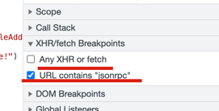

经过实测，即使把`Any XHR or fetch`勾上，也是不行的。（TODO: investigate）

我回忆起了当时的做法，是在console面板勾选了xhr打印：

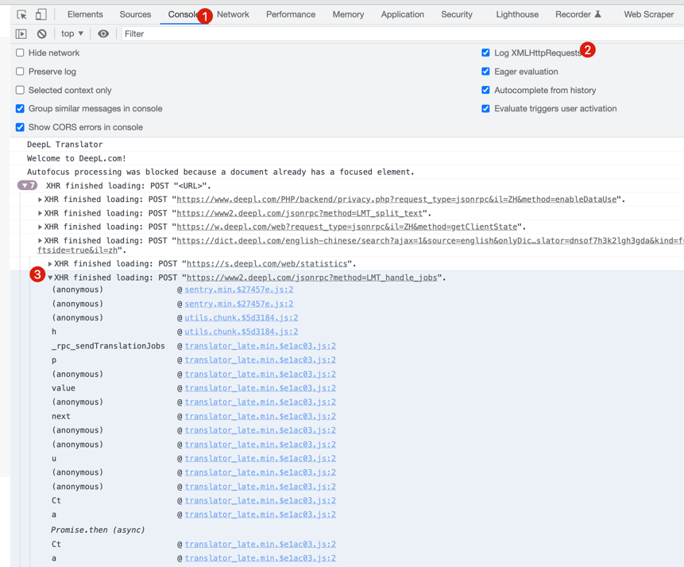

对，就是这样！非常轻松，它会打印出所有的xhr请求与每个请求的调用栈，然后我们只要一步步找到我们的目标xhr链接即可。

点击其中的frame后就跳转过来了，此时由于压缩没法看，点击这个花括号展开：

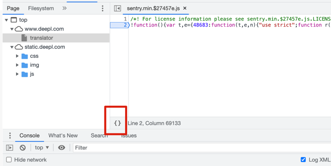

接着开始下断点（这个时候还没有调用栈）：

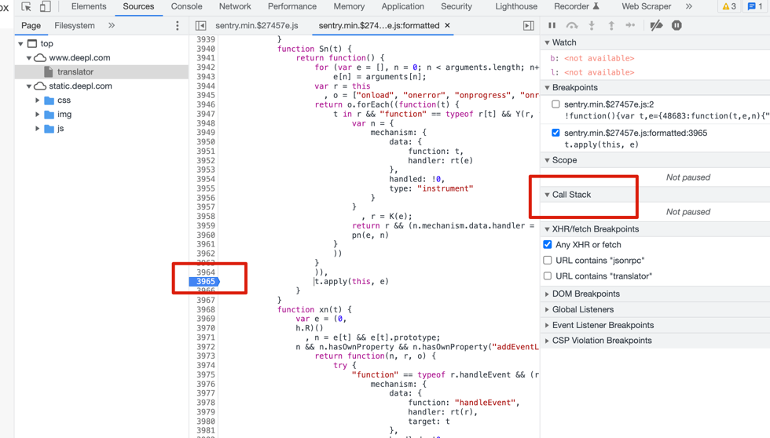

然后刷新一下，就有调用栈了：

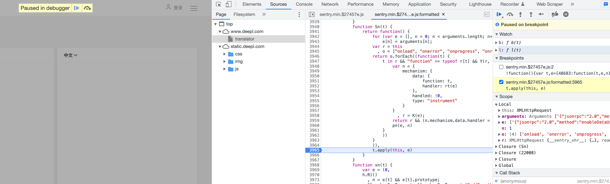

### 2. 如何断函数与变量

函数与变量有几种断的方法。

首先最重要的就是不断地在调用栈里穿梭，直到摸清所有变量的生成规则。

比如我们刷新断到最顶帧，此时所有变量都已经是生成好了的（看scope），但我们需要知道他们的生成规则，于是就要在(call stack)里一步步往下点。

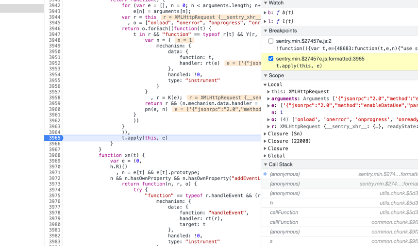

比如点到第四帧的时候就找到我们的主函数了。其实也可以看出点规律，调用栈里 anonymous 的是不用看的，直接看正常函数名的与文件名的。

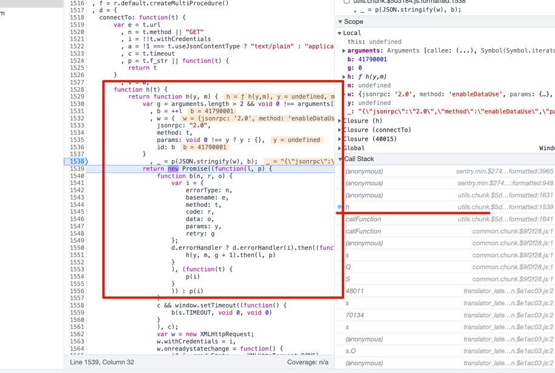

接下来，还有一些重要函数，可能断点进不去，我后来意识到可能是走了类似反射的形式，但我们可以有两种办法：

1. 打开分离式console，然后去打印函数，看看是啥 
2. 【非常关键】按照closure的原则一步步点开直到目标位置，就出来了！

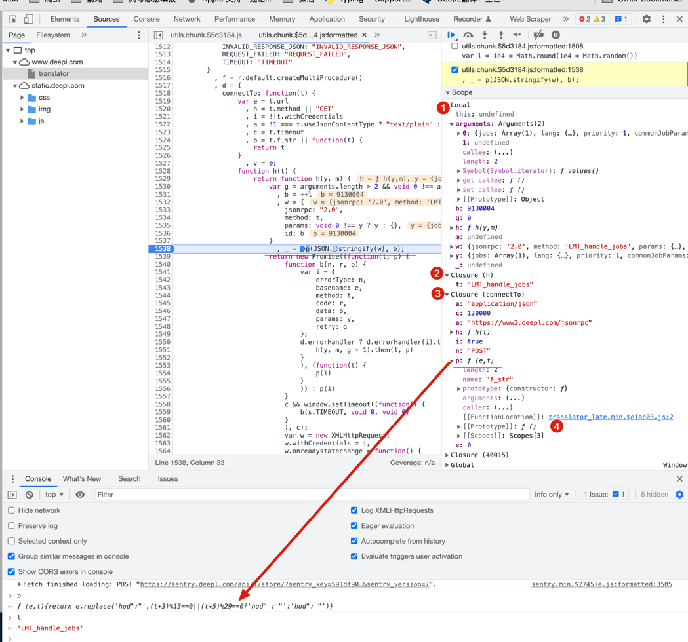

这样我们就顺利地找到p函数的实现了：

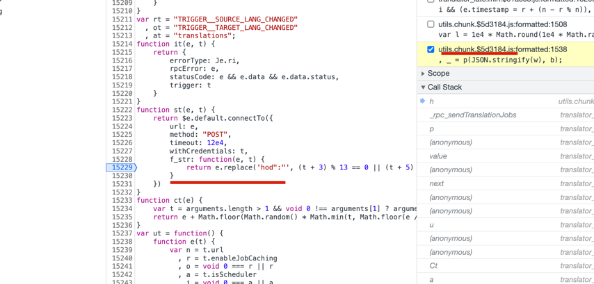

之后，就全部是封装的活了。

## hack result

### how is the id generated

1. generated to a 8-digit random integer
2. ++
3. send to the id

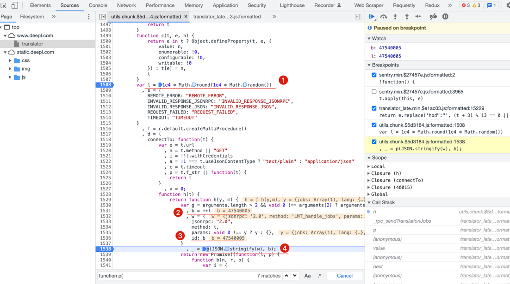

### what is the id for

it's for transforming the data to be posted.

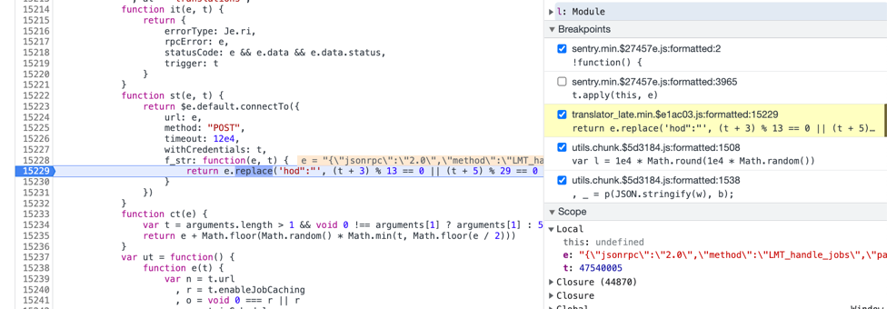

the transform function accepted two arguments:

1. the json data (with a id key) encoded to string
2. id

### how is the timestamp generated

based on current time, and with a little shift using the count of `i` in text to translate.

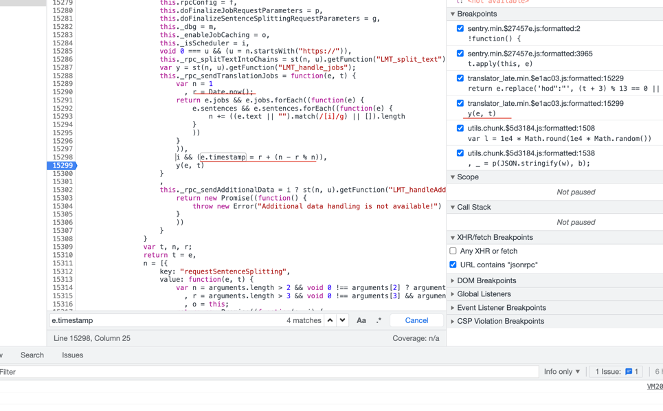

## funny time

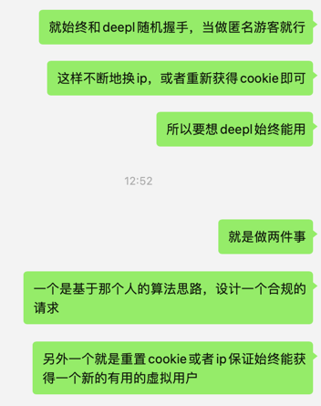

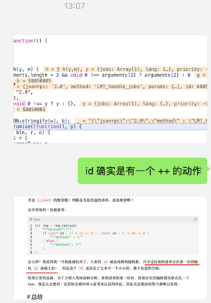

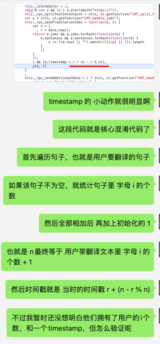

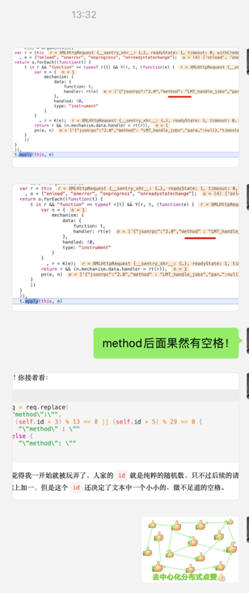

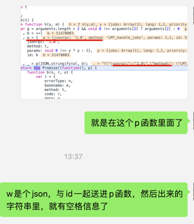

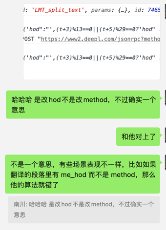

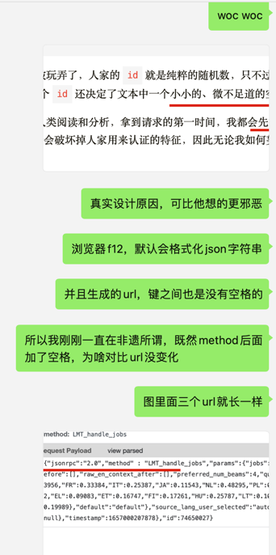

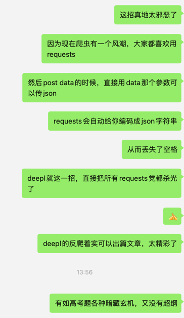

