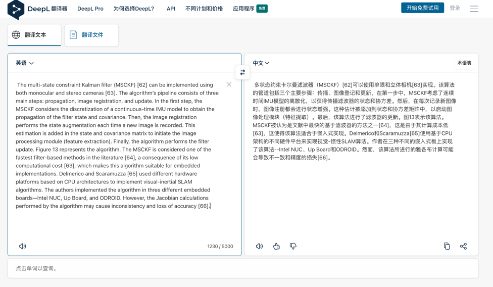

# deepl web api (unofficial)



## global guide

[readme](../readme.md)

## project guide

### run

```shell
cd src
python main.py "Are You OK?"
# 你还好吗？
```

### possible problems

如果返回 `Too many requests` 的错误，最好的做法是换个proxy。

比如我的vpn是基于 clashx 的，所以可以切换欧美、日韩等不同的线路，从而保证大多数情况下可用。

目前还没有集成自动更换代理，需要一段时间观察网站实际表现。

## hack manual

[hack-manual](./hack-manual.md)
